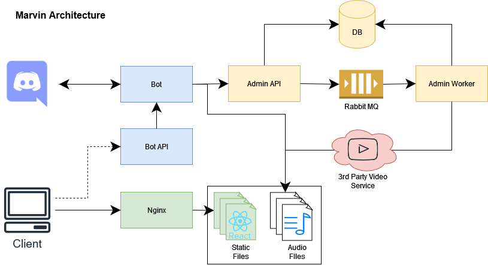

> There's only one life-form as intelligent as me within thirty parsecs of here and that's me.


# Marvin Bot

Marvin is a simple music bot for Discord made with Discord.js.

It allows the users to play songs from both a third party service and also from the filesystem.

It alsos allows users to create and manage their playlists with a simple and friendly user interface.

## Current Architecture

Marvin is, as of today, running in three different containers:
* `marvin`: the bot itself
* `marvin_app`: a nginx container that serves the static React files and serves as the reverse proxy to api calls sent to `marvin_admin`
* `marvin_admin`: a express service that queries and updates a relational database and also downloads songs from a third party service to the filesytem




<!-- 
## Running Marvin

### Requirements
1. Discord Bot [Token](https://discordjs.guide/preparations/setting-up-a-bot-application.html#creating-your-bot)
2. Nodejs v12.0.0

The Discord token should be exported as a environment variable or inside a `.env:

```
export DISCORD_TOKEN=<discord_token>
export SOUNDCLOUD_CLIENT_ID=<soundcloud_client_id>
export API_ENABLED=<Wheter to expose the message api>
export API_PORT=<Port to serve the api, defaults to 3000>
```

Then it is as easy as running:
```
npm install
npm run start
```

Alternativately, the easiest way of running Marvin would be via Docker:

```
$ docker run -e DISCORD_TOKEN=<discord_token> -e SOUNDCLOUD_CLIENT_ID=<soundcloud_client_id> henriqueamitay/marvin:latest
```

## Setting up playlists

Marvin has a built-in feature that allows the administrator to set up playlists from local music files.

Marvin will look for folders inside the `./playlists` directory and use them as a sort of menu, for instance, suppose we had the following folder structure:

```
marvin_home_directory
│ index.js
│
└─playlists
  │
  └───awesome_songs
  │   │── MrFinishLine.mp3
  │   └── AnimalSpirits.mp3
  └───goldies
      │── Hurricane.mp3
      └── YouDreamFlatTires.mp3

```

By running `_marvin menu` on discord, marvin will output both the `awesome_songs` and `goldies` folders as playlist options.

Lastly by running `_marvin playlist goldies` marvin will play both `Hurricane.mp3` and `YouDreamFlatTires.mp3` songs in a random order.

### Playlists and Docker

If you are running Marvin in a docker container (and you should), you can map a volume to allow the container to find local song files by running:

```
docker run -d --name marvin -v <your song directory>:/app/playlists \
-e DISCORD_TOKEN=$DISCORD_TOKEN \
-e SOUNDCLOUD_CLIENT_ID=$SOUNDCLOUD_CLIENT_ID \
henriqueamitay/marvin:latest
``` -->
